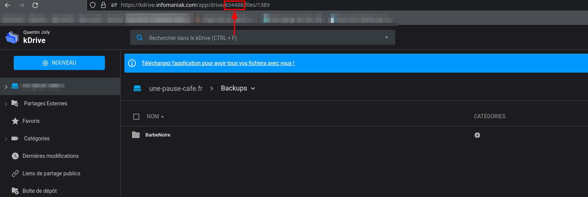

<p align="center">
    
    <br>
    
</p>


## How it works

I use kDrive from Infomaniak to store my backups, to send them I use RClone with a WebDav backend *(WebDav is the only way to send backups to kDrive)*. Since I don’t own the server where I store my backups, I encrypt them using age before sending them.

This project can easily be adapted to any other WebDav provider.

## Install dependencies (without Nix)
### Install age

You need to install age to encrypt your backups, you can do it with the following commands:

```bash
make install-age
```

### Install RClone

You need to install RClone to send your backups, you can do it with the following commands:

```bash
make install-rclone
```

## Install dependencies (with Nix)

There is no need to install dependencies if you use Nix, the script use nix-shell to install them in a temporary environment.

## Configure RClone

Before using my script you need to configure RClone, you can do it with the following commands:

```bash
rclone config create kDrive webdav url "https://YOUR_KDRIVE_ID.connect.kdrive.infomaniak.com" vendor other user "YOUR_INFOMANIAK_EMAIL" pass "YOUR_INFOMANIAK_PASS"
```

You can find your kDrive ID in the kDrive web interface:



If 2FA is enabled on your Infomaniak account, you need to create an app password and use it instead of using your account password. You can create an app password in the Infomaniak web interface: [here](https://manager.infomaniak.com/v3/681270/ng/profile/user/connection-history/application-password)

## Usage

```bash
./backup.sh
```